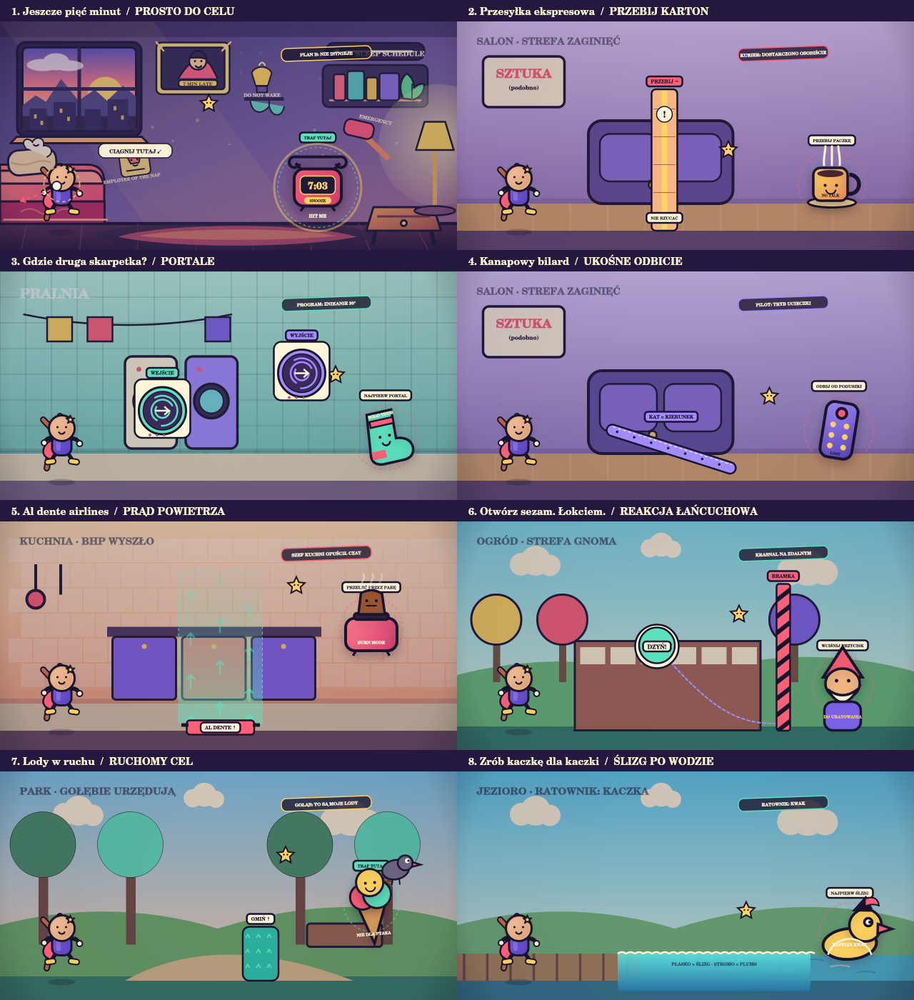

# SlingToon Web 0.13.0 — Controlled Catastrophe

An offline-capable HTML5 Canvas PWA prepared for GitHub Pages. No JUCE, Projucer or native build is required for browser testing.

Version 0.13 replaces the repeated trampoline puzzle with eight distinct missions: direct shot, breakable delivery, washing-machine portals, angled cushion, steam lift, switch-and-gate chain, moving target and limited water skips. Physics, predictions and replay share a deterministic 120 Hz solver. From mission five, a single optional FIK air maneuver adds an active choice. Stars, medals and a mission map create replay goals; permanent hint unlocks can be hidden. Existing scores, tokens and campaign unlocks migrate without resetting earned progress.

The game still has no server/runtime dependencies. Portraits remain local, and the crop-free mobile camera is preserved. See [the Polish rebuild brief](docs/PROMPT_PRZEBUDOWY_PL.md) and [QA status](docs/QA_0_13_PL.md), including the outstanding real-device/browser playtest.



## Run

```bash
npm run serve
```

Open `http://localhost:4173`.

Touch: pull the hero and release. Keyboard: Space starts aiming, arrows adjust the pull, Space launches. From mission five, tap the FIK button, the playfield or Space once in flight for an upward/forward impulse. R retries. Click the level counter for the mission map.

## Validate

```bash
npm run check
```

## Deploy

Push the repository contents with `index.html` at repository root, then select `Settings → Pages → Deploy from a branch → main → /(root)`. The included workflows remain available for Git-based development.

See `README_PL.md` for full instructions and `docs/MIGRATION_PLAN_PL.md` for the native migration gates.
