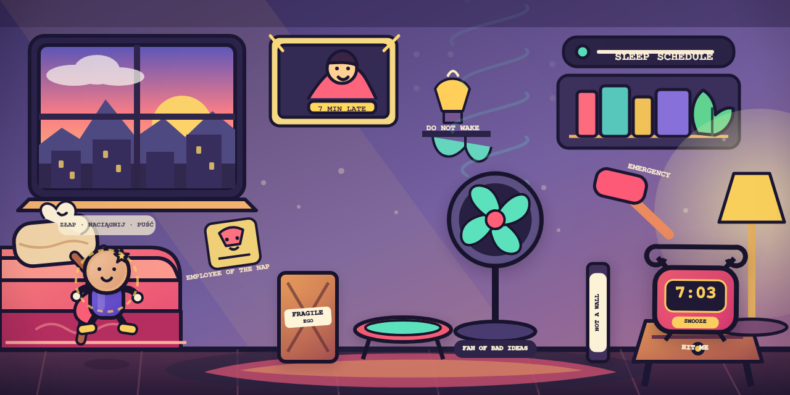

# SlingToon Web 0.7 — GitHub Pages / PWA

Samodzielna gra webowa przygotowana w tym samym modelu publikacji co Castle Conflict. Do uruchomienia i wdrożenia nie potrzeba JUCE, Projucera ani Xcode.



## Uruchomienie lokalne

W katalogu projektu wpisz:

```bash
npm run serve
```

Następnie otwórz `http://localhost:4173`.

Nie uruchamiaj gry przez dwukrotne kliknięcie `index.html`. Lokalny serwer jest potrzebny dla modułów JavaScript i testu trybu offline.

## Wgranie do GitHub

1. Utwórz puste repozytorium, np. `slingtoon`.
2. Wgraj **zawartość tego katalogu** do głównego katalogu repozytorium. `index.html` musi znajdować się w root.
3. Wejdź w `Settings → Pages`.
4. W `Build and deployment → Source` wybierz `Deploy from a branch`.
5. Ustaw `main` oraz `/(root)`, a następnie kliknij `Save`.
6. Po każdym nowym wgraniu plików poczekaj na zakończenie publikacji w karcie `Actions`.

Paczka zawiera również workflow dla pracy z Git, ale do prostego wgrywania plików przez stronę GitHub wystarcza publikacja z `main / (root)`.

Adres będzie miał postać:

`https://NAZWA-UZYTKOWNIKA.github.io/slingtoon/`

Wszystkie ścieżki są względne, więc projekt działa również jako repozytorium projektowe GitHub Pages.

## Instalacja na iPhonie/iPadzie

1. Otwórz adres gry w Safari.
2. Wybierz `Udostępnij`.
3. Wybierz `Do ekranu początkowego`.

Gra uruchamia się pełnoekranowo i po pierwszym wczytaniu działa offline.

## Sterowanie

- `Quick Sling`: złap bohatera, naciągnij i puść.
- `One Move`: najpierw przesuń trampolinę dokładnie raz, następnie oddaj strzał.
- Po porażce `What If?` automatycznie powtarza ten sam zapisany strzał z jednym zmienionym prawem fizyki.
- Przycisk `☺` najpierw otwiera lokalne Face Studio. Dopiero wewnątrz wybierasz zdjęcie, a następnie przesuwasz, powiększasz lub obracasz je przed zatwierdzeniem. Plik nie jest wysyłany.
- Na telefonie gra jest przeznaczona do pozycji poziomej; cały interfejs automatycznie dopasowuje się do widocznej wysokości Safari.

## Testy

```bash
npm run check
npm run build
npm run smoke
```

Testy sprawdzają Quick Sling, One Move, identyczny replay What If, realne działanie czterech modyfikatorów, różnice między osobowościami, matematykę kadrowania twarzy oraz serwowanie gotowego artefaktu GitHub Pages.

## Struktura

- `src/game.js` — fizyka i reguły bez zależności od przeglądarkowego UI,
- `src/render.js` — Canvas, avatar, scena i VFX,
- `src/audio.js` — lokalny dźwięk proceduralny,
- `src/face-studio.js` — lokalne wczytanie, kadrowanie, zoom i obrót twarzy,
- `src/main.js` — sterowanie i UI,
- `assets/` — edytowalne assety i ikony,
- `sw.js` — tryb offline,
- `.github/workflows/` — testy i publikacja GitHub Pages.

## Status

To grywalny vertical slice PWA. Nie jest jeszcze podpisanym plikiem dla App Store. Plan ewentualnego przejścia do warstwy natywnej znajduje się w `docs/MIGRATION_PLAN_PL.md`.
